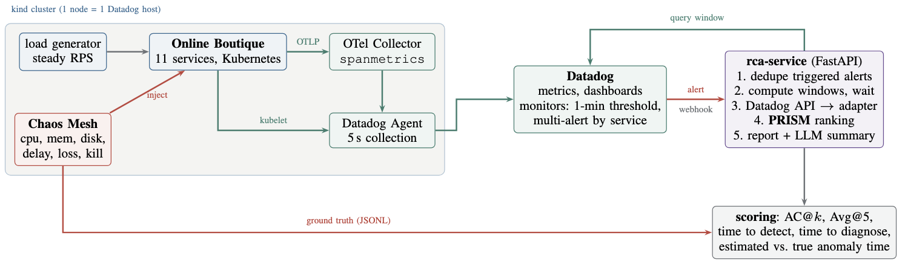

# rca-sim

<p align="center">
  
</p>

<details>
<summary>TikZ source for the diagram above</summary>

```latex
\scalebox{0.80}{\begin{tikzpicture}[node distance=6mm]

% ---- cluster -----------------------------------------------------------
  \node[box=cInfra, minimum width=26mm] (app)
       {\textbf{Online Boutique}\\11 services, Kubernetes};
  \node[box=cInfra, left=8mm of app, minimum width=14mm] (load)
       {load generator\\steady RPS};
  \node[box=cRoot, below=8mm of load, minimum width=14mm] (chaos)
       {\textbf{Chaos Mesh}\\cpu, mem, disk,\\delay, loss, kill};
  \node[box=cData, right=8mm of app, minimum width=20mm] (otel)
       {OTel Collector\\\texttt{spanmetrics}};
  \node[box=cData, below=8mm of otel, minimum width=20mm] (agent)
       {Datadog Agent\\5\,s collection};

  \begin{scope}[on background layer]
    \node[draw=cInfra!40, fill=cBg, rounded corners=3pt,
          fit=(load)(app)(otel)(agent)(chaos), inner sep=5pt] (cluster) {};
  \end{scope}
  \node[font=\tiny, text=cInfra, anchor=south west] at ($(cluster.north west)+(0,0.5mm)$)
       {kind cluster (1 node = 1 Datadog host)};

  \draw[flow] (load) -- (app);
  \draw[dflow] (app) -- node[above, font=\tiny, text=cData] {OTLP} (otel);
  \draw[dflow] (otel) -- (agent);
  \draw[dflow] (app.south) |- node[pos=0.75, above, font=\tiny, text=cData] {kubelet} (agent.west);
  \draw[rflow] (chaos) -- node[right, font=\tiny, text=cRoot, pos=0.4] {inject} (app);

% ---- datadog -----------------------------------------------------------
  \node[box=cData, right=13mm of cluster.east, anchor=west, minimum width=24mm] (dd)
       {\textbf{Datadog}\\metrics, dashboards\\monitors: 1-min threshold,\\multi-alert by service};
  \draw[dflow] (agent.east) -- ++(4mm,0) |- (dd.west);

% ---- rca service -------------------------------------------------------
  \node[box=cAgent, right=11mm of dd, minimum width=30mm] (svc)
       {\textbf{rca-service} (FastAPI)\\
        1. dedupe triggered alerts\\
        2. compute windows, wait\\
        3. Datadog API $\rightarrow$ adapter\\
        4. \textbf{PRISM} ranking\\
        5. report + LLM summary};
  \draw[rflow] (dd) -- node[above, font=\tiny, text=cRoot, pos=0.5] {alert}
                      node[below, font=\tiny, text=cGrey, pos=0.5] {webhook} (svc);
  \draw[dflow] (svc.north) -- ++(0,4mm) -| node[pos=0.25, above, font=\tiny, text=cData]
                                             {query window} (dd.north);

% ---- ground truth / scoring -------------------------------------------
  \node[box=cGrey, below=11mm of svc, minimum width=30mm] (score)
       {\textbf{scoring}: AC@$k$, Avg@5,\\time to detect, time to diagnose,\\
        estimated vs.\ true anomaly time};
  \draw[flow] (svc) -- (score);
  \draw[rflow] (chaos.south) |- node[pos=0.72, above, font=\tiny, text=cRoot]
                                {ground truth (JSONL)} (score.west);

\end{tikzpicture}}
```

</details>

Online Boutique runs on a local `kind` cluster under steady load. Datadog collects its metrics. Chaos
Mesh injects faults on demand. A Datadog monitor detects the incident. PRISM then ranks the root cause
from the window Datadog itself provides.

PRISM is the graph-free RCA method from
[`automated_root_cause_analysis`](https://github.com/ArthurrMrv/automated_root_cause_analysis). It is
vendored unchanged in `rca-service/app/prism/`.

Every injection is logged as ground truth, so the whole loop is scorable. AC@k, as in RCAEval. Plus
two numbers the offline benchmark cannot give: how long detection takes, and what it costs not to know
the injection time.

| Where to look | For |
|---|---|
| `IMPLEMENTATION_PLAN.md` | Why each piece is the way it is. Decision log D1-D18, phases, risks. |
| `CLAUDE.md` | How to work in this repo. Architecture, data contract, conventions. |
| `docs/verified.md` | What has been checked against the live system. |

## From an empty machine to a running loop

### 0. Prerequisites

Python >= 3.11. Docker running with at least **4 CPUs / 6 GB RAM / 20 GB disk** available to it.
6 CPUs / 8 GB is comfortable. On macOS and Windows that budget is the Docker Desktop VM's own
allocation (Settings -> Resources), not the host's. The default is often too small.

```bash
# macOS (Docker Desktop installed separately)
brew install kind kubectl helm cloudflared python@3.11
```

```bash
# Linux (Debian/Ubuntu)
sudo apt-get update
sudo apt-get install -y docker.io python3-venv curl

KIND=https://kind.sigs.k8s.io/dl/v0.23.0/kind-linux-amd64
KUBECTL=https://dl.k8s.io/release/v1.30.2/bin/linux/amd64/kubectl
CFD=https://github.com/cloudflare/cloudflared/releases/latest/download/cloudflared-linux-amd64

curl -fsSL "$KIND"    -o /tmp/kind    && sudo install /tmp/kind    /usr/local/bin/kind
curl -fsSL "$KUBECTL" -o /tmp/kubectl && sudo install /tmp/kubectl /usr/local/bin/kubectl
curl -fsSL "$CFD"     -o /tmp/cfd     && sudo install /tmp/cfd     /usr/local/bin/cloudflared
curl -fsSL https://raw.githubusercontent.com/helm/helm/main/scripts/get-helm-3 | bash
```

### 1. Get the repo

```bash
git clone https://github.com/ArthurrMrv/datadog_sim_arca.git
cd datadog_sim_arca
```

### 2. Datadog credentials

**2a. API key.** *Organization Settings -> API Keys -> New Key*. This is what the in-cluster Agent
uses to ship metrics. A token cannot replace it.

**2b. Service Access Token.** *Organization Settings -> Service Accounts*. Create or pick a service
account, then *Access Tokens -> + New Token*. Set expiry to **Never** for a long campaign. Select
**exactly these six scopes**. Nothing else is needed, and nothing else should be granted:

| Scope | Why this pipeline needs it |
|---|---|
| `timeseries_query` | the adapter pulls the incident window (`GET /api/v1/query`) |
| `monitors_read` | the poller reads monitor state; `make monitors` checks what already exists |
| `monitors_write` | `make monitors` creates and updates the five monitors |
| `create_webhooks` | `make monitors` registers the webhook that calls rca-service |
| `dashboards_read` | `make monitors` checks whether the dashboard exists before creating it |
| `dashboards_write` | `make monitors` creates and updates the dashboard |

Scope names are case-sensitive. To only *run* the loop against monitors that already exist
(`make rca`, `make analyze`, `make status`), `timeseries_query` and `monitors_read` are sufficient.

**2c. Fill in `.env`.** `DD_SITE` is the host part of your Datadog URL (`datadoghq.eu`,
`datadoghq.com`, `us5.datadoghq.com`, ...).

```bash
cp .env.example .env
${EDITOR:-nano} .env
```

### 3. Install the service

PRISM is in-tree. This pulls nothing heavier than pandas.

```bash
make venv
```

### 4. Check the checkout before touching the cloud

69 tests. No cluster, no account.

```bash
make test
```

### 5. Bring up the cluster

Takes ~10 min: kind, Online Boutique, Agent, Collector, Chaos Mesh. Use `PREPULL=1 make up` where the
node cannot reach a registry. That is common in Codespaces and devcontainers. It also reuses the
host's image cache on a re-created cluster.

```bash
make up
```

### 6. Let the baseline settle for 15 minutes

Thresholds calibrated on a warming cluster are wrong.

```bash
kubectl -n shop get pods -w
```

### 7. Gate: is every metric family arriving?

A family reading "no data" means its query does not match what the cluster emits. Fix
`rca-service/app/adapter/queries.yaml` before going further.

```bash
make status
```

### 8. Calibrate thresholds

Calibrate on a quiet hour, then write the values into `datadog/monitors/monitors.yaml`. The ones in
git are placeholders.

```bash
make calibrate HOURS=1
```

### 9. Expose the webhook

Leave it running. Copy the `https://....trycloudflare.com` URL it prints.

```bash
make tunnel
```

### 10. Create the monitors, webhook and dashboard

Put the `RCA_DASHBOARD_ID` it prints into `.env`.

```bash
make monitors URL=https://<tunnel-url>/webhook
```

### 11. Start the RCA service

Run it in another terminal. Use `make rca MODE=poll` instead if you skipped step 9.

```bash
make rca
```

### 12. Inject a fault

A monitor fires in ~2 min. The report lands ~3 min later.

```bash
make inject FAULT=delay SERVICE=cartservice DURATION=300
```

### 13. Read the result

```bash
cat results/incidents/*/report.md
```

## After the first incident

`results/analysis.ipynb` reads whatever is in `results/` and plots what happened: detection latency
per fault type, AC@k against ground truth, the anatomy of a single incident, and how far the estimated
anomaly time fell from the real one. It runs before a campaign too, and says what is missing.

`make eval` runs a full campaign. That is ~3.5 h at `repetitions: 1`, ~10.7 h as configured.
`make sweep` re-ranks every stored incident at 1s / 5s / 15s. `make down` deletes the cluster, and
`results/` survives. `make help` lists every target.

## Status

The code and configuration for all eight phases are in place. The offline half is verified. Tests
cover the data contract, the adapter, the window arithmetic, the webhook path and the scoring, and
they run PRISM for real on a Datadog-shaped payload. The vendored PRISM is checked against upstream's
own demo. Every container metric name and all five monitor definitions have been validated against the
Datadog API, and the spanmetrics configuration against the connector's documentation
(`docs/verified.md`).

What is left open needs the cluster running: tag presence, 5s collection, the demo's tracing env vars,
and calibrated thresholds. `make status` is what surfaces them.
